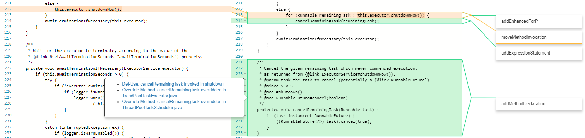

# CLDIFF-WEB
### This is a web gui implementation for [CLDIFF](https://github.com/FudanSELab/CLDIFF)

### How to start

CLDIFF-WEB uses maven to package war file. The machine should be installed with maven already.
1. cd to CLDIFF-WEB directory.
2. use command `mvn package`. Then the war package should be generated under 'target'.
3. put CLDIFF-WEB.war under tomcat and the page should be ready().(http://localhost:8080/indexoffline.html).
Apart from port 8080, CLDIFF-WEB also occupies port 8082, be careful.

### Snapshot of CLDIFF-WEB

### TODO

editor.main.js 89453 MouseHandler.prototype._onMouseDown 

